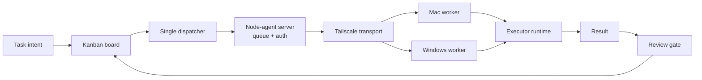
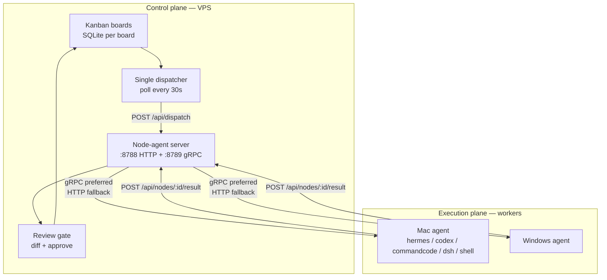

# Switchyard

Control plane for coding agents. Switchyard stores boards and tasks, selects workspaces, claims tasks, dispatches work to executors, and holds results in `review` until changes are inspected and approved.

Part of a two-repo system:

- **Switchyard** (this repo) — control plane: boards, tasks, single dispatcher, review gate → https://github.com/adityahimaone/switchyard
- **[node-agent](https://github.com/adityahimaone/node-agent)** — execution plane: runs tasks on the host that owns the source code (Mac / Windows workers)

Stack: Go, SQLite, React, Vite, and node-agent over gRPC-hybrid with HTTP long-poll fallback.

## Architecture



The VPS runs the control plane and scheduler. Node-agent runs the execution plane on every host that owns source code. Remote workspaces are never used as `cwd` by local VPS processes. Paths like `/Users/...` and `C:\...` are routed to their registered host.



## Dispatcher and transport

`cmd/server/ssh_dispatch.go` is the single owner for task claims. It polls every 30 seconds. Successful tasks land in `review` — never `done` directly.

| Task choice | Route | Executor |
|---|---|---|
| `auto` | Legacy SSH from VPS | Hermes on VPS, file access over SSH |
| `hermes` | node-agent | Hermes on workspace host |
| `codex` | node-agent | Codex on workspace host |
| `commandcode` | node-agent | CommandCode on workspace host |
| `dsh` | node-agent | DeepSeek Harness session on workspace host |

`auto` is kept for backward compatibility with old tasks. New tasks that need a local worker should pick an explicit executor. Node-agent prefers gRPC when available and falls back to HTTP long-poll when the gRPC stream is down.

Force transport via node-agent config:

```text
NODE_AGENT_TRANSPORT=auto  # auto | grpc | http
NODE_AGENT_GRPC_TARGET=<VPS_TAILSCALE_IP>:8789
```

- `grpc` is fail-closed when gRPC is unavailable.
- `http` forces the compatibility lane.
- gRPC port `8789` must stay private on the tailnet.

### Hard guard, claim, and retry

- Remote paths with an empty transport are routed by `remoteTransportForPath`: `/Users/...` and `C:\...` resolve to `node-agent` with default targets `mac-tailscale` and `windows-tailscale`. An explicitly set `ssh` or `node-agent` transport is honored as-is.
- A `/Users/...` path must never be downgraded to SSH or executed on the VPS — both are treated as misconfiguration, not as a fallback.
- In-flight tasks are `running`.
- Successful results become `review`, not `done`.
- Failures retry up to 3 times, then become `blocked`.
- `review` tasks cannot be moved to `done` via a plain `PATCH` status — they must go through the review gate.

## Task intent and executor

Tasks store human intent as `title` + `description`. Users pick an AI executor only to force a specific runtime:

```json
{"executor": "commandcode"}
```

Valid values: `auto`, `hermes`, `codex`, `commandcode`, `dsh`, `shell`.

`shell` is a normal task executor for direct remote commands. `command` is the only executed input; `body` is descriptive text and is never executed. Empty/whitespace `command` is rejected at task create (`400 shell executor requires command`) and by both dispatchers as `blocked`. Shell preflight (`NODE_AGENT_SHELL_PREFLIGHT=1`) and output compaction (`NODE_AGENT_SHELL_CAVEMAN=1`) are opt-in on the worker and use environment only — they never mutate `command`.

## DeepSeek Harness sessions

`dsh` tasks keep one DeepSeek Harness session per card and advance it across
review rounds. `harness_bindings` stores the binding; the dispatcher sends
`dsh_workspace_id`, `dsh_session_id`, `last_turn_seq`, `last_comment_id`,
`run_id`, and `session_continuation` to node-agent.

Rules:

- The workspace path is fixed per card. A resumed session whose cwd differs from
  the dispatched workspace is rejected rather than retried.
- The worker never clears `dsh_session_id` and never creates a new session to
  escape a failure. A returned session other than the dispatched one fails the
  result as `worker returned session "...", dispatched session was "..."`.
- `last_turn_seq` only moves forward. A stale turn sequence or a missing
  session/workspace id fails finalization, so a stale worker result cannot
  overwrite a newer run.
- `last_comment_id` advances only after a successful turn, so failed turns
  replay unconfirmed review comments.
- Cards without a binding adopt the legacy `tasks.dsh_session_id` on dispatch.

Looping a card: post the comment, then reopen the card from `review` so the
dispatcher claims it again.

```sh
hermes kanban --board <board> comment <card> --author user "<message>"
hermes kanban --board <board> reopen-review <card>
```

A plain comment does not reopen a card that is already in `review`.

On the worker, `dsh` runs under an isolated `DSH_HOME` so its session locks stay
off the `dsh web` daemon's, and finished sessions are published back into
`~/.dsh` so the UI can list them. Worker-side contract and troubleshooting:
[node-agent docs/dsh-harness.md](https://github.com/adityahimaone/node-agent/blob/master/docs/dsh-harness.md).

### CommandCode

Node-agent follows the official CommandCode CLI:

```sh
cmd -p "<prompt>" --yolo --skip-onboarding --output-format text
```

On Windows the binary alias is `cmdc`. Node-agent probes `cmd`, `cmdc`, or `command-code` depending on platform. `--yolo` allows the worker to edit files and run shell commands — use it only on trusted nodes.

## Review gate

Every executor uses the same gate:

1. Agent mutates the working tree but does not commit or push.
2. Board fetches the diff from the workspace host.
3. User picks **Commit** or **Commit & Push**.
4. Board runs approval over SSH.
5. Status moves from `review` → `done`.

```text
GET  /api/boards/{slug}/tasks/{id}/diff
POST /api/boards/{slug}/tasks/{id}/approve
```

Approval body:

```json
{"action": "commit", "message": "optional commit message"}
```

or `{"action": "commit_push"}`.

The review workspace must point at the correct Git repository.

## Node-agent contract

This repo is the **control plane**. The [node-agent](https://github.com/adityahimaone/node-agent) repo is the **execution plane**. Switchyard sends the following payload to `POST /api/dispatch`:

```json
{
  "task_id": "t1",
  "board": "saas",
  "message": "Fix login validation",
  "workspace": "/Users/<user>/Development/saas",
  "executor": "codex"
}
```

For `executor: "dsh"` the dispatcher adds the session continuity fields:

```json
{
  "task_id": "t1",
  "board": "saas",
  "message": "Continue from the last review comment",
  "workspace": "/Users/<user>/Development/saas",
  "executor": "dsh",
  "dsh_workspace_id": "<uuid>",
  "dsh_session_id": "session-<uuid>",
  "last_turn_seq": 2,
  "last_comment_id": 41,
  "run_id": "<uuid>",
  "session_continuation": true
}
```

The result must echo `dsh_workspace_id`, `dsh_session_id`, and the highest
consumed `last_turn_seq`. Identity mismatches fail the result; they are never
silently accepted.

For internal shell dispatch the orchestrator sends `executor: "shell"` plus `command`. The dispatcher resolves the host from the workspace, uses node-agent as the primary route, and may fall back to SSH.

On register each node advertises capabilities:

```json
{
  "node_id": "mac",
  "workspaces": ["/Users/<user>/Development"],
  "executors": ["hermes", "codex", "commandcode", "dsh", "shell"],
  "versions": {"commandcode": "..."}
}
```

The server picks a node by workspace prefix + executor capability. If the requested executor is unavailable the dispatch is rejected with `executor unavailable`.

Dispatch ack returns `transport` and `delivery_id`. That metadata is forwarded to Kanban Flow diagnostics so operators can see the actual path (`grpc` or `http`) a task took.

Worker details and the gRPC contract live in [node-agent](https://github.com/adityahimaone/node-agent), including `docs/specs/2026-09-07-grpc-hybrid-node-agent-transport.md`.

## Workspace

Workspace source of truth is `~/.hermes/workspaces.json` (shared with Hermes CLI and node-agent):

```json
{
  "workspaces": [
    {
      "id": "saas",
      "path": "/Users/<user>/Development/saas",
      "host": "mac-tailscale",
      "os": "mac",
      "note": "PHP legacy. Do not commit from agent."
    }
  ]
}
```

`note` is forwarded as `PrequestNote`. When empty, node-agent reads `AGENTS.md` or the first lines of `README.md` from the workspace. Workspace entries may also carry `luvus_workspace_id`, `remote`, and `apps` — every save must merge unknown keys back; dropping them breaks other consumers.

## API

| Method | Path | Purpose |
|---|---|---|
| GET / POST | `/api/boards`, `/api/boards/{slug}/tasks` | Boards and tasks |
| PATCH | `/api/boards/{slug}/tasks/{id}/status` | Status transitions |
| PATCH | `/api/boards/{slug}/tasks/{id}/assignee` | Change Hermes profile |
| GET | `/api/boards/{slug}/tasks/{id}/diff` | Diff from remote workspace |
| POST | `/api/boards/{slug}/tasks/{id}/approve` | Commit or push |
| GET/POST/PUT/DELETE | `/api/workspaces*` | Workspaces and health |
| GET | `/api/flow/active` | Active flow tasks |
| POST | `/api/remote/dispatch` | Manual dispatch to node-agent |
| GET | `/api/nodes` | Node-agent status |

All `/api/*` routes require the `kanban_session` HttpOnly cookie except `/api/auth/status`, `/api/auth/login`, `/api/auth/logout`, and `/api/auth/password`.

## Context optimization

The execution pipeline has three context-reduction layers:

1. **codegraph** — structural index of the codebase on the workspace host. Used for `hermes`/`codex`/`commandcode` (and shell only when `NODE_AGENT_SHELL_PREFLIGHT=1`).
2. **rtk** — reduces verbose shell command and output within bounded timeouts (hook check + rewrite `800 ms` each; `rtk pipe --ultra-compact` with `2 s` cap when `NODE_AGENT_SHELL_CAVEMAN=1`).
3. **caveman** — optional compact output for shell (`NODE_AGENT_SHELL_CAVEMAN=1`, `>8 KiB`, fail-open). AI executors already produce their own structured result.

Shell agentic path gives a read-only planner workspace visibility, then executes structured commands through shell + RTK with bounded iterations. `body` is task intent; `command` remains the direct-mode input. Workspace routing, remote-path classification, flow tracking, and review gate remain as documented in `docs/execution-flow.md`.

## Configuration

| Key | Location | Purpose |
|---|---|---|
| `kanban.dispatch_in_gateway` | `~/.hermes/config.yaml` | Set `false` — prevents a second dispatcher |
| `workspaces` | `~/.hermes/workspaces.json` | Workspaces, hosts, OS, prequest notes |
| `NODE_AGENT_TOKEN` | `~/.hermes/node-agent.env` | Shared secret, file mode `0600` |
| `KANBAN_NODE_AGENT` | env | Override node-agent HTTP base URL (default `http://127.0.0.1:8788`) |
| `KANBAN_NODE_AGENT_TOKEN` | env | Shared auth token for node-agent HTTP + gRPC metadata |
| `KANBAN_SSH_TARGET` | env | Override SSH target for review and legacy transport |
| `TYPESAFE_API_KEY` | env | Optional TypeSafe AI key; enables JEV task classification before dispatch |
| `TYPESAFE_JEV_MODEL` | env | Optional JEV model override (default `jev-latest`) |
| `TYPESAFE_API_URL` | env | Optional TypeSafe endpoint override (default `https://api.typesafe.ai/v1/systemone`) |
| `NODE_AGENT_DSH_HOME` | worker env | Isolated DeepSeek Harness home for agent runs (see node-agent docs) |
| `NODE_AGENT_DSH_PUBLISH` | worker env | `0` stops publishing agent DSH sessions into `~/.dsh` |

## Build and deploy

### Rollout order

For staged rollout, the VPS can be updated first. Mac/Windows agents do not need an immediate upgrade — old nodes keep running with their previous capabilities.

1. Build and restart the `node-agent` server on the VPS — exposes HTTP `:8788` + gRPC `:8789`.
2. Build and restart `kanban-board` (Switchyard) on the VPS.
3. Cross-build the target worker binary (`GOOS=darwin GOARCH=arm64` for Apple Silicon, or the matching Windows target).
4. Reinstall the agent binary on Mac/Windows and restart the LaunchAgent / service.
5. Confirm the node is `idle` and the new capability + `transports` appear at `/api/nodes`.
6. Run a dispatch canary and assert `success=true`, `delivery_id`, and transport `grpc` (or fallback `http`).

```sh
go vet ./...
go test ./...
go build -o bin/kanban-board ./cmd/server
cd web && pnpm build
pm2 restart kanban-board
```

`pnpm` is build-time tooling only. Production serves static `web/dist` from the Go binary; no Node or Bun runtime stays alive. Bun migration is intentionally not needed for runtime memory reduction. Go remains the runtime for Switchyard and node-agent because both are compiled, low-RSS binaries.

Deploying on the VPS does not automatically replace the agent binary running on Mac. Mac upgrades are separate via `scripts/install-mac.sh` in the [node-agent](https://github.com/adityahimaone/node-agent) repo.

Frontend builds are RAM-heavy. On a 2 GB VPS, stop large PM2 processes first if the build OOMs. Never stop `9router` — it is the gateway.

## Project structure

| Path | Role |
|---|---|
| `cmd/server/main.go` | HTTP API and startup |
| `cmd/server/ssh_dispatch.go` | Single dispatcher, legacy SSH, and node-agent routing |
| `internal/kanban/kanban.go` | Task model and column migrations |
| `internal/kanban/nodeagent.go` | Node-agent HTTP client |
| `internal/kanban/workspace_validate.go` | Workspace path validation |
| `web/src/features/board/TaskDialog.tsx` | Task form and executor picker |
| `web/src/features/board/TaskDetail.tsx` | Task detail and metadata |
| `docs/specs/` | Design decisions and review gate |

## Troubleshooting

### `executor unavailable on node`

Make sure the binary is available on the worker host and restart node-agent so capabilities are re-registered:

```sh
curl -H "X-Node-Agent-Token: <token>" http://<vps>:8788/api/nodes
```

Hybrid health check:

```sh
curl -H "X-Node-Agent-Token: <token>" http://<vps>:8788/health
```

A healthy node is `idle`. gRPC workers show `transports: ["grpc", "http"]`. When the gRPC stream drops, `auto` mode falls back to HTTP and the transport badge in Flow switches to `http`.

If the VPS server is already new but the Mac agent has not been upgraded yet, new executors like `commandcode` will not appear on that node — expected until the Mac installer is re-run.

### Remote task tries to run on the VPS

Check `workspace_path`, `workspace_transport`, and `workspace_ssh_target`. Mac/Windows paths must be registered in `workspaces.json`.

### `dsh_session_conflict`

Another process owns the card's DSH write handle — normally the `dsh web` daemon
on the same home. Confirm the Mac worker uses its isolated `DSH_HOME`
(`lsof -p <worker-pid> | grep session.lock`). Raising
`NODE_AGENT_DSH_CONFLICT_RETRIES` does not release a foreign lock. See
[node-agent docs/dsh-harness.md](https://github.com/adityahimaone/node-agent/blob/master/docs/dsh-harness.md).

### DSH card keeps failing identity checks

`worker returned session "..."` / `worker result omitted session id` /
`worker returned stale turn sequence` mean the worker did not resume the
dispatched session. The worker must not start a cold session on a continuation.
Check the worker log at `$TMPDIR/node-agent-<task_id>/run.log` for the
`--session-id` argument actually used.

### Completed DSH task is missing from the `dsh web` UI

The session is published by the worker after a successful run. Check that
`NODE_AGENT_DSH_PUBLISH` is not `0` and that the worker log shows
`dsh session publish: mirrored session ...`.

### Task stuck in `review`

Expected. Open the diff, then pick **Commit** or **Commit & Push**.

## Related repositories

- [node-agent](https://github.com/adityahimaone/node-agent) — execution plane (worker service)
- [CommandCode headless mode](https://commandcode.ai/docs/headless)
- [CommandCode CLI reference](https://commandcode.ai/docs/reference/cli)
- [RTK](https://github.com/rtk-ai/rtk)
- [Caveman](https://github.com/JuliusBrussee/caveman)

## Design docs

- [Single dispatcher and review gate](docs/specs/2026-09-07-single-dispatcher-review-gate-design.md)
