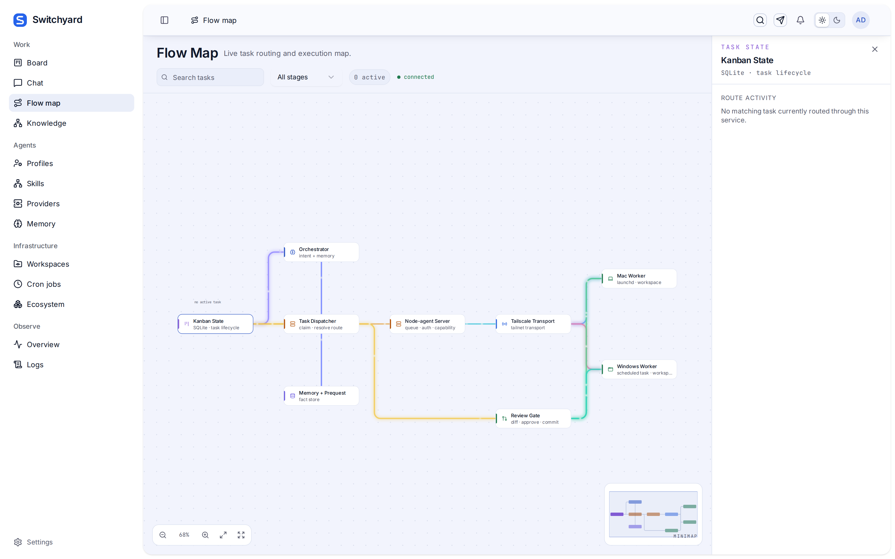
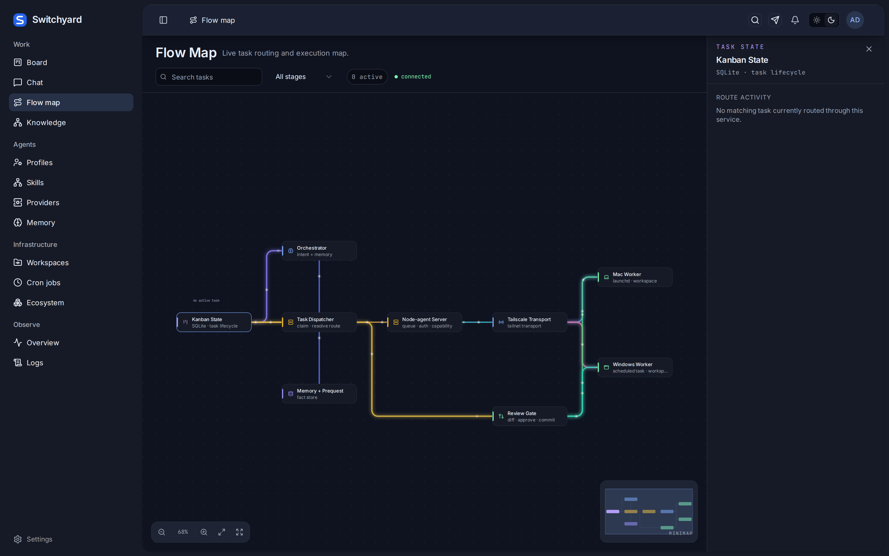

# Screenshots

Reference captures of redesigned surfaces, checked in so a PR can show the
result rather than ask a reviewer to run the app. The main grid lives in the
[project README](../../README.md); this folder holds the source images.

The four README captures use a consistent 2400×1400 viewport at 1× device scale.
Kanban and Chat are captured in dark mode; Flow Map and Overview are captured in
light mode. Their content uses an isolated demo board and fictional chat activity.

## Flow map — opaque nodes and docked inspector

The node cards, the zoom control bar and the minimap were `glass-card` /
`glass-strong` over a flat dotted canvas. In dark mode `--glass-tint` is only
40% opaque, so the nodes washed out, and each one also painted an 18px glow in
its own colour. The inspector used to be an `absolute right-0 shadow-2xl`
overlay covering the routing it described; it now takes a 320px column beside
the map.

| | |
|---|---|
|  |  |

Both capture the same state: the **Kanban State** node selected, with the
inspector docked on the right. Captured at 1600×1000, 2× device pixel ratio.

The dark capture is the one that matters — it is where the transparency was
actually visible. The nodes now sit as solid `surface` cards with a 1px
`line` border and a coupler tick in their own status colour, which is what
`design-surfaces.md` §12 specifies.