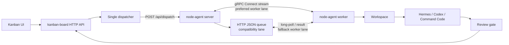
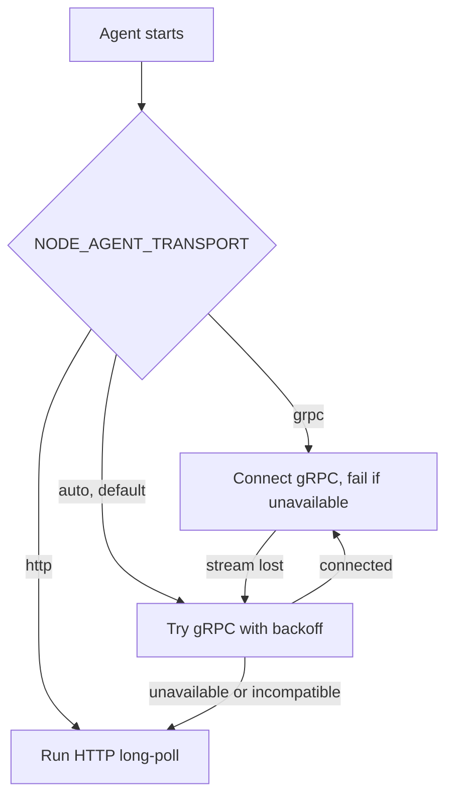

# Hybrid gRPC transport for node-agent

Status: proposed.  
Scope: `kanban-board` and `node-agent`.  
Decision owner: platform maintainers.

## 1. Purpose

Add a persistent gRPC transport between the node-agent server on the control host and
node-agent workers on workspace hosts. Keep the existing HTTP JSON API as a compatible
control-plane ingress and worker fallback.

The migration must not interrupt existing kanban task dispatch. A worker that has not
been upgraded must continue to long-poll `/api/nodes/{id}/poll`. A new worker must fall
back to HTTP JSON if the gRPC listener is unavailable or the gRPC session cannot be
established.

This change improves the worker channel, not the user-facing kanban API. Browsers and
the kanban frontend continue to use HTTP JSON.

## 2. Why hybrid instead of a direct replacement

The current long-poll protocol is adequate for jobs that run for minutes. The expensive
part is the agent runtime and tool calls, not request framing. gRPC is valuable here for
persistent bidirectional delivery, progress events, cancellation, and typed messages.

Replacing HTTP immediately would combine a transport migration with scheduler changes.
The hybrid design separates those risks:

| Surface | Phase 1 behavior | Future behavior |
|---|---|---|
| Kanban UI to kanban-board | HTTP JSON | HTTP JSON |
| kanban-board to node-agent server | HTTP JSON | HTTP JSON, unless a separate server API migration is approved |
| node-agent server to worker | HTTP long-poll or gRPC | gRPC preferred, HTTP retained as fallback |
| Health, nodes, diagnostics | HTTP JSON | HTTP JSON |

## 3. Target architecture



Transport selection is owned by the worker:



The server accepts both protocols during every migration phase. A worker uses exactly
one delivery channel at a time, so one task cannot be delivered simultaneously through
gRPC and HTTP.

## 4. Non-goals

- Replacing the kanban-board HTTP API with gRPC or gRPC-Web.
- Exposing a gRPC endpoint to browsers.
- Removing SSH review and approval operations.
- Changing the task status model or bypassing the review gate.
- Making task execution exactly-once. The system remains at-least-once and must make
  delivery and result handling idempotent.
- Adding automatic installation of executors, RTK, codegraph, or caveman.

## 5. Compatibility contract

The following current HTTP endpoints remain supported without behavior changes:

```text
POST /api/dispatch
GET  /api/results/{task_id}
GET  /api/nodes
GET  /health
POST /api/nodes/register
POST /api/nodes/{id}/heartbeat
GET  /api/nodes/{id}/poll
POST /api/nodes/{id}/result
```

`POST /api/dispatch` remains the only kanban-board to node-agent-server dispatch call
in phase 1. The node-agent server routes the accepted task to an available worker
session, preferring a gRPC session and otherwise using the existing HTTP queue.

Older workers do not include `transports` during HTTP registration. The server treats
that as `['http']`.

## 6. Delivery correctness requirements

Every dispatched job needs the following identifiers:

| Field | Meaning |
|---|---|
| `task_id` | Stable kanban task identifier |
| `attempt` | Monotonically increasing delivery attempt for the task |
| `delivery_id` | UUID for one lease of one attempt |
| `node_id` | Worker selected by workspace routing |
| `lease_expires_at` | Server deadline for acknowledgement and result |

Required behavior:

1. Server creates a queued delivery with `delivery_id`.
2. Worker receives `DispatchJob` and returns `JobAck` before execution.
3. Server marks the delivery leased only after the ack matches `delivery_id`.
4. Worker sends `JobResult` containing the same `delivery_id`.
5. Server accepts the first valid terminal result for a delivery and acknowledges it.
6. Duplicate ack or duplicate result is safe and returns the existing acknowledgement.
7. A lost stream before ack leaves the delivery eligible for requeue after its lease.
8. A lost stream after ack must not result in a second concurrent execution. Requeue only
   after lease expiry and after the server has confirmed no terminal result exists.

The existing kanban database remains the task lifecycle source of truth. The in-memory
node-agent queue remains an ephemeral delivery mechanism in phase 1. Server restart can
lose a live delivery, but kanban status reconciliation and dispatcher retry provide the
current recovery path.

## 7. Protobuf contract

Create `node-agent/proto/nodeagent/v1/nodeagent.proto`:

```proto
syntax = "proto3";

package nodeagent.v1;

option go_package = "node-agent/gen/nodeagent/v1;nodeagentv1";

service NodeAgentService {
  rpc Connect(stream WorkerFrame) returns (stream ServerFrame);
}

message WorkerFrame {
  oneof payload {
    Register register = 1;
    Heartbeat heartbeat = 2;
    JobAck job_ack = 3;
    JobProgress job_progress = 4;
    JobResult job_result = 5;
  }
}

message ServerFrame {
  oneof payload {
    RegisterAck register_ack = 1;
    DispatchJob dispatch_job = 2;
    CancelJob cancel_job = 3;
    ResultAck result_ack = 4;
    ServerNotice notice = 5;
  }
}

message Register {
  string node_id = 1;
  string hostname = 2;
  string version = 3;
  repeated string workspaces = 4;
  repeated string executors = 5;
  map<string, string> versions = 6;
  repeated string transports = 7; // grpc, http
}

message RegisterAck {
  string session_id = 1;
  int64 heartbeat_interval_ms = 2;
}

message Heartbeat {
  string node_id = 1;
  string status = 2; // idle, busy
  int64 sent_at_unix_ms = 3;
}

message DispatchJob {
  string delivery_id = 1;
  uint32 attempt = 2;
  string task_id = 3;
  string board = 4;
  string message = 5;
  string workspace = 6;
  string executor = 7;
  string command = 8; // internal orchestrator dispatch only
  string model = 9;
  string provider = 10;
  string prequest_note = 11;
  int64 lease_expires_at_unix_ms = 12;
}

message JobAck {
  string delivery_id = 1;
  bool accepted = 2;
  string reason = 3;
}

message JobProgress {
  string delivery_id = 1;
  string phase = 2; // preflight, executing, finalizing
  string message = 3;
  int64 at_unix_ms = 4;
}

message JobResult {
  string delivery_id = 1;
  string task_id = 2;
  bool success = 3;
  string output = 4;
  string error = 5;
  int64 duration_ms = 6;
}

message CancelJob {
  string delivery_id = 1;
  string reason = 2;
}

message ResultAck {
  string delivery_id = 1;
  bool accepted = 2;
}

message ServerNotice {
  string code = 1;
  string message = 2;
}
```

`command` remains an internal payload for orchestrator-generated shell operations. It
must not be exposed as a user-authored kanban task field.

## 8. Required repository changes

### node-agent repository

| File | Change |
|---|---|
| `proto/nodeagent/v1/nodeagent.proto` | New protobuf source |
| `buf.yaml` | New Buf module configuration |
| `buf.gen.yaml` | Go and gRPC generator definitions |
| `gen/nodeagent/v1/*.go` | Generated protobuf output, committed to the repository |
| `internal/transport/transport.go` | Add `Transports` to registration and shared delivery metadata |
| `internal/heartbeat/registry.go` | Store active transport and gRPC session availability |
| `internal/session/manager.go` | New session registry, delivery lease, ack, result idempotency |
| `cmd/server/grpc.go` | New gRPC listener and `Connect` implementation |
| `cmd/server/main.go` | Start HTTP and gRPC listeners, route jobs to preferred session |
| `cmd/agent/grpc_client.go` | New reconnecting bidirectional gRPC client |
| `cmd/agent/http_client.go` | Extract existing long-poll loop without behavior changes |
| `cmd/agent/main.go` | Select `auto`, `grpc`, or `http` transport |
| `cmd/agent/run_job.go` | Extract current `runJob` so both clients call identical execution logic |
| `README.md` | Add gRPC configuration, rollout, and diagnostics |

### kanban-board repository

| File | Change |
|---|---|
| `internal/kanban/nodeagent.go` | Keep HTTP dispatch. Parse `transports` and active transport from health response. Improve error text when no compatible worker exists. |
| `cmd/server/ssh_dispatch.go` | No protocol-specific logic. It continues to call `DispatchRemote`, which remains HTTP JSON. |
| `internal/kanban/flow.go` | Optionally include `transport` in `FlowTask` for observability. Do not change status behavior. |
| `web/src/features/flow/*` | Show active worker transport as diagnostic metadata only. Do not let UI choose protocol. |
| `README.md` | Explain that HTTP remains the kanban contract while gRPC is the worker channel. |

The kanban board must not connect directly to the gRPC worker stream. This keeps its
runtime and deployment independent from protobuf and HTTP/2 worker concerns.

## 9. Configuration

Server:

```sh
NODE_AGENT_ADDR=:8788                 # Existing HTTP JSON server
NODE_AGENT_GRPC_ADDR=:8789            # New internal gRPC listener
NODE_AGENT_TOKEN=<shared-secret>
NODE_AGENT_GRPC_ENABLED=1
NODE_AGENT_GRPC_LEASE_SECONDS=660
```

Worker:

```sh
NODE_AGENT_SERVER=http://<VPS_TAILSCALE_IP>:8788
NODE_AGENT_GRPC_TARGET=<VPS_TAILSCALE_IP>:8789
NODE_AGENT_TOKEN=<shared-secret>
NODE_AGENT_TRANSPORT=auto             # auto, grpc, http
NODE_AGENT_JOB_TIMEOUT=600
```

For the initial private-tailnet rollout, gRPC uses HTTP/2 without TLS and attaches the
shared token as gRPC metadata. Tailscale provides transport encryption. If the listener
is exposed beyond the private tailnet, phase 2 must add TLS or mTLS before exposure.

## 10. Server skeleton

`node-agent/cmd/server/grpc.go`:

```go
type grpcServer struct {
    nodeagentv1.UnimplementedNodeAgentServiceServer
    sessions *session.Manager
}

func (s *grpcServer) Connect(stream nodeagentv1.NodeAgentService_ConnectServer) error {
    if err := authenticateMetadata(stream.Context()); err != nil {
        return status.Error(codes.Unauthenticated, "invalid node token")
    }

    first, err := stream.Recv()
    if err != nil { return err }
    reg := first.GetRegister()
    if reg == nil { return status.Error(codes.InvalidArgument, "register must be first frame") }

    sess, err := s.sessions.RegisterGRPC(reg, stream)
    if err != nil { return status.Error(codes.InvalidArgument, err.Error()) }
    defer s.sessions.Remove(sess.ID)

    if err := stream.Send(registerAck(sess)); err != nil { return err }
    return s.sessions.ReceiveWorkerFrames(sess, stream)
}
```

`node-agent/internal/session/manager.go`:

```go
func (m *Manager) Dispatch(req transport.DispatchRequest) (Delivery, error) {
    node := m.RouteWorkspaceAndExecutor(req.Workspace, req.Executor)
    if node == nil { return Delivery{}, ErrNoCompatibleNode }

    delivery := m.NewDelivery(req, node.ID)
    if sess := m.ActiveGRPCSession(node.ID); sess != nil {
        if err := sess.Send(dispatchFrame(delivery)); err == nil { return delivery, nil }
    }
    if err := m.EnqueueHTTP(node.ID, delivery); err != nil { return Delivery{}, err }
    return delivery, nil
}
```

The HTTP handler calls `sessions.Dispatch` instead of writing directly to the existing
per-node channel. Existing HTTP poll handlers obtain only deliveries assigned to the
HTTP lane.

## 11. Worker skeleton

`node-agent/cmd/agent/grpc_client.go`:

```go
func runGRPC(ctx context.Context, cfg Config, execute ExecuteFunc) error {
    conn, err := grpc.DialContext(ctx, cfg.GRPCTarget,
        grpc.WithTransportCredentials(insecure.NewCredentials()),
        grpc.WithPerRPCCredentials(tokenCredentials{Token: cfg.Token, Insecure: true}),
    )
    if err != nil { return err }
    defer conn.Close()

    stream, err := nodeagentv1.NewNodeAgentServiceClient(conn).Connect(ctx)
    if err != nil { return err }
    if err := stream.Send(registerFrame(cfg)); err != nil { return err }

    for {
        frame, err := stream.Recv()
        if err != nil { return err }
        if job := frame.GetDispatchJob(); job != nil {
            if err := stream.Send(ackFrame(job.GetDeliveryId(), true, "")); err != nil { return err }
            go executeAndReport(ctx, stream, job, execute)
        }
    }
}
```

The production implementation must serialize stream `Send` calls with a mutex or a
dedicated outgoing frame channel. The skeleton uses `go` only to show the lifecycle;
the current single-worker concurrency model should be retained until parallel job
execution is designed explicitly.

## 12. Transport selection skeleton

`node-agent/cmd/agent/main.go`:

```go
switch cfg.Transport {
case "http":
    return runHTTP(ctx, cfg, runJob)
case "grpc":
    return retryGRPC(ctx, cfg, runJob, false)
case "auto":
    if err := retryGRPC(ctx, cfg, runJob, true); err == nil {
        return nil
    }
    return runHTTP(ctx, cfg, runJob)
default:
    return fmt.Errorf("invalid NODE_AGENT_TRANSPORT %q", cfg.Transport)
}
```

`auto` fallback policy:

- Try gRPC for a bounded startup window, for example 10 seconds.
- If server returns `Unimplemented`, `Unavailable`, connection refused, or deadline
  exceeded, start HTTP long-poll.
- While in HTTP mode, retry gRPC with exponential backoff every 60 seconds.
- On successful gRPC registration, stop HTTP polling before accepting gRPC deliveries.
- If gRPC drops, drain or abandon no active job, then retry gRPC before returning to HTTP.

## 13. Rollout plan

### Phase 0: preparation

1. Add metrics and structured logs for HTTP dispatch, queue depth, result latency, and
   worker reconnects.
2. Add `transports` to the existing HTTP registration response and node health output.
3. Confirm every task has idempotent `task_id` and result handling.

### Phase 1: server capability

1. Add protobuf generation and gRPC listener on `:8789`.
2. Keep all HTTP handlers and queues active.
3. Deploy server to VPS with `NODE_AGENT_GRPC_ENABLED=1`.
4. Verify `grpcurl` or a small test client can connect through Tailscale.
5. Do not change existing workers.

### Phase 2: one canary worker

1. Upgrade one non-critical worker with `NODE_AGENT_TRANSPORT=auto`.
2. Verify it registers `grpc` and `http` capabilities.
3. Dispatch a read-only task, then an edit-plus-review task.
4. Kill the gRPC stream during an idle period and verify HTTP fallback.
5. Kill the gRPC stream during a job and verify no duplicate execution.

### Phase 3: observability and cancellation

1. Emit `JobProgress` from preflight, execution, and finalization.
2. Add `CancelJob` from the existing kanban stop endpoint through the node-agent server.
3. Display active transport and delivery id in the Flow Map and task events.

### Phase 4: general rollout

1. Upgrade remaining workers in `auto` mode.
2. Keep HTTP fallback for at least one release cycle.
3. Compare gRPC and HTTP failure rates, reconnects, and duplicate-delivery counters.
4. Make gRPC preferred by default only after the canary criteria pass.

### Phase 5: optional hardening

1. Add TLS or mTLS if the endpoint leaves the private tailnet.
2. Persist delivery leases if server restart recovery needs stronger guarantees.
3. Decide whether to retire worker HTTP polling. Do not remove HTTP admin and health APIs.

## 14. Acceptance criteria

- Existing HTTP-only worker executes task after server gRPC deployment.
- `auto` worker uses gRPC when the gRPC listener is healthy.
- `auto` worker falls back to HTTP after gRPC failure without manual restart.
- Explicit `grpc` worker fails loudly rather than silently using HTTP.
- One task execution produces at most one accepted terminal result per `delivery_id`.
- A duplicate result does not change kanban state twice.
- Review gate still moves success to `review`, never directly to `done`.
- Stop task cancels a gRPC job or marks it stopped through the existing safe lifecycle.
- `/api/nodes` shows executors, versions, supported transports, and active transport.
- Flow Map shows dispatcher, worker route, review gate, executor, and active transport.
- `go test ./...` passes in both repositories.

## 15. Test matrix

| Case | Expected result |
|---|---|
| Old worker, new server | HTTP long-poll continues unchanged |
| New worker `http` | HTTP long-poll only |
| New worker `grpc`, server disabled | Explicit startup error |
| New worker `auto`, server disabled | HTTP fallback |
| New worker `auto`, server enabled | gRPC session established |
| gRPC reconnect before job ack | Delivery is requeued once after timeout |
| gRPC reconnect after job ack | No concurrent duplicate execution |
| Duplicate `JobResult` | First accepted, later result acknowledged idempotently |
| Node lacks executor | Dispatch rejected before delivery |
| Worker is offline | Task follows existing retry and blocked behavior |
| Agent task succeeds | Task moves to review |
| Review approval succeeds | Commit then task moves to done |

## 16. Risks and mitigations

| Risk | Mitigation |
|---|---|
| HTTP/2 or gRPC unavailable on a worker network | `auto` falls back to HTTP long-poll |
| Duplicate execution after reconnect | Lease, ack, delivery id, idempotent result store |
| Incompatible protobuf versions | Add protocol version to register and reject unsupported major version |
| Stream send races | Single outgoing-frame writer per stream |
| gRPC server restart | Worker reconnect with backoff; kanban retry remains source of recovery |
| Token sent over plaintext gRPC | Restrict listener to Tailscale; add TLS or mTLS before broader exposure |
| Scope expansion into scheduler rewrite | Preserve HTTP dispatch endpoint and current task lifecycle |

## 17. Operations runbook

Verify HTTP compatibility:

```sh
curl -H "X-Node-Agent-Token: <token>" \
  http://<VPS_TAILSCALE_IP>:8788/health
```

Verify gRPC listener from a tailnet host after the service is implemented:

```sh
grpcurl -plaintext \
  -H "x-node-agent-token: <token>" \
  <VPS_TAILSCALE_IP>:8789 list
```

Expected worker diagnostics:

```text
transport=grpc session=<id> node=<node-id> executors=hermes,codex,commandcode,dsh,shell
```

If gRPC is unhealthy, set `NODE_AGENT_TRANSPORT=http` on a worker or set `auto` and
restart it. Do not stop the HTTP listener while any worker still depends on it.

## 18. Follow-up documentation updates

After phase 1 is implemented, update:

- `node-agent/README.md` with gRPC listener, worker modes, and fallback behavior.
- `kanban-board/README.md` with the hybrid control-plane and worker-channel distinction.
- Flow Map labels and legend with active transport.
- Deployment scripts with `NODE_AGENT_GRPC_ADDR` and `NODE_AGENT_TRANSPORT`.
- Runbooks with `grpcurl` diagnostics and rollback instructions.
